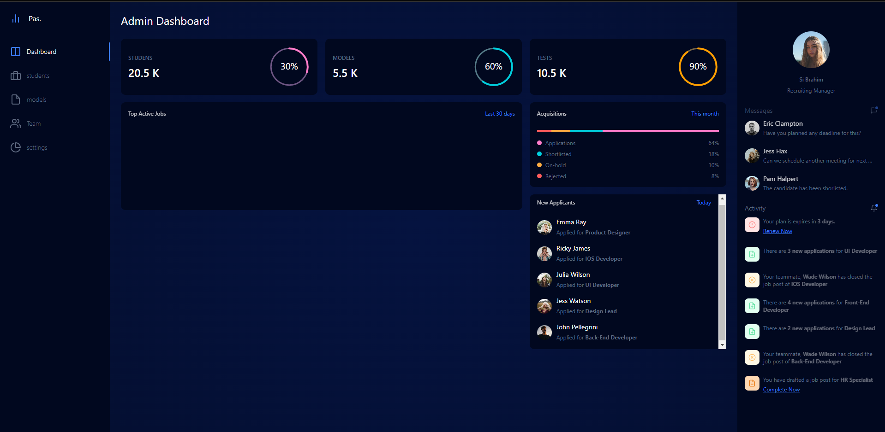

                             
# Online-Assignment            Pas.          
## Fll Stack Django Application
###### teams : 4
> let's start
This site was built using [Online-Assignment ](https://assignment-online.herokuapp.com/dashboard/)

- [ ] Add delight to the experience when all tasks are complete :tada:

> You can just create an virtual enviroment with virtualenv env and start it with env/bin/activate.
> You will need to reinstall all dependencies using pip, but the rest should just work fine.

todo install all those deppendencies:
#!  >   pip install  Django asgiref boto3 botocore django-cors-headers django-cors-middleware django-filter django-storages djangorestframework djangorestframework-simplejwt gunicorn jmespath mysqlclient Pillow PyJWT python-dateutil pytz s3transfer six sqlparse tzdata urllib3 whitenoise